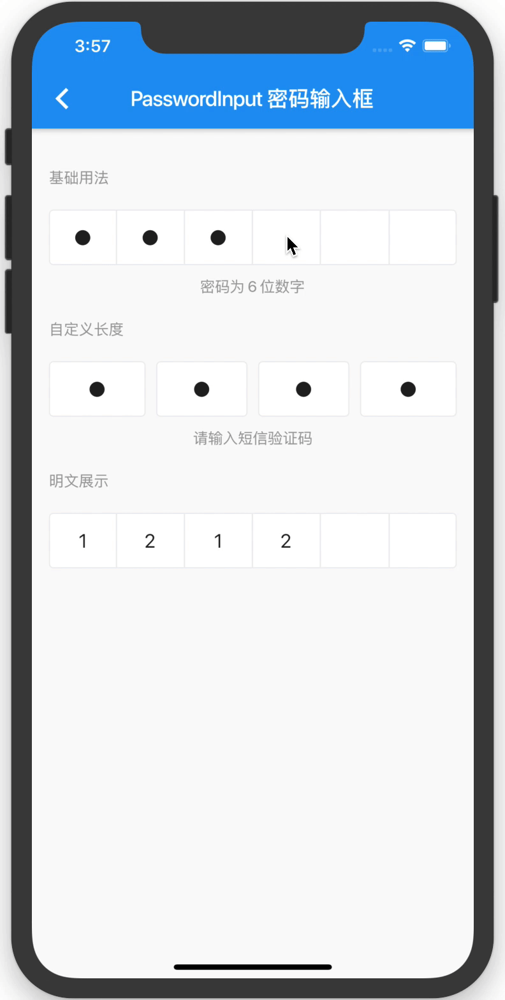

# Flutter Vant Kit

Flutter Vant Kit is a [Vant](https://youzan.github.io/vant/#/zh-CN/intro) style flutter UI library.

## Introduction

### How to use

```
dependencies:
  flutter_vant_kit: ^0.2.2
```

### How to run demo

```
cd example/
flutter run
```

## API

View [Documentation](https://benjaken.gitbook.io/flutter-vant-kit) 或 【[中文版](./doc/zh)|[English](./doc/en)】

## Demo Screenshot





