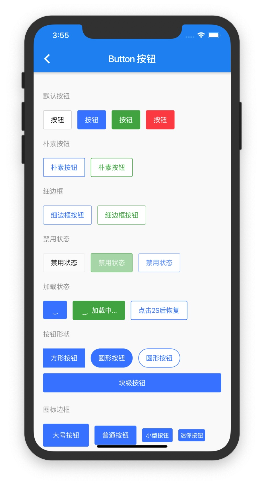
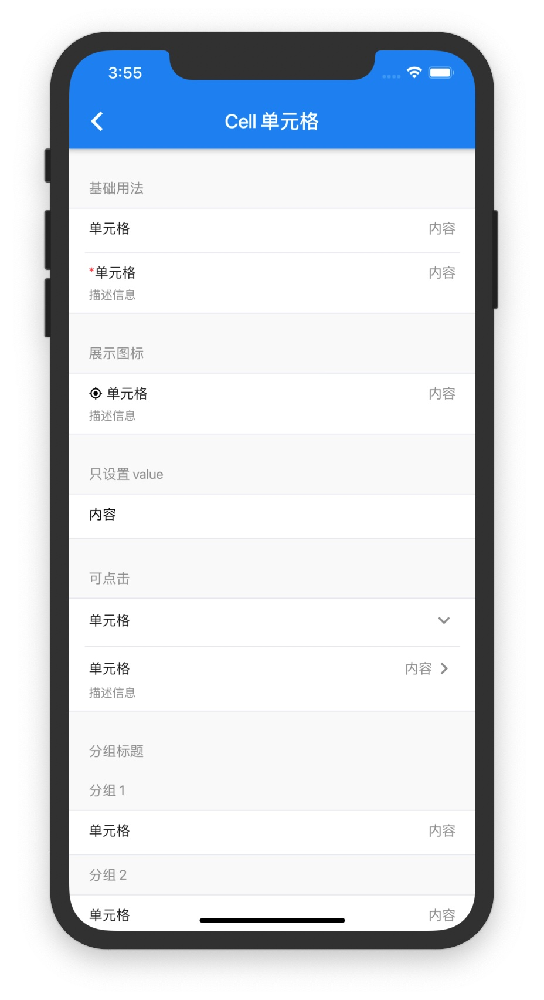
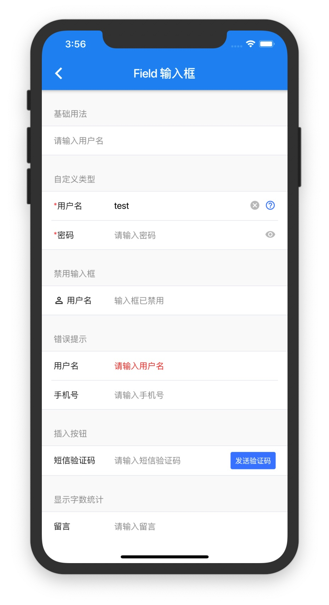

# Flutter 组件库

Flutter Kit 是仿[Vant](https://youzan.github.io/vant/#/zh-CN/intro)组件库的flutter widget库

个人学习项目

## 项目介绍

### 如何使用

```
dependencies:
  flutter_vant_kit: ^0.1.7
```

### 运行Demo

```
cd example/
flutter run
```

## 组件介绍

| 基础组件 |
| ------ |
| [Button 按钮](doc/button.md) |
| [Cell 单元格](doc/cell.md) |
| Image 图片 |
| [Avatar 头像](doc/avatar.md) |

| 表单组件 |
| ------ |
| [Checkbox 复选框](doc/checkbox.md)  |
| [Field 输入框](doc/field.md) |
| [NumberKeyboard 数字键盘](doc/numberKeyboard.md) |
| [PasswordInput 密码输入框](doc/passwordInput.md) |
| [Radio 单选框](doc/radio.md) |
| [Rate 评分](doc/rate.md) |
| [Search 搜索](doc/search.md) |
| [Stepper 步进器](doc/stepper.md) |
| [ImageWall 图片选择器](doc/imageWall.md) |

| 反馈组件 |
| ------ |
| [ActionSheet 上拉菜单](doc/actionSheet.md)  |
| [Dialog 弹窗](doc/dialog.md) |
| [Divider 分割线](doc/divider.md) |

| 展示组件 |
| ------ |
| [Badge 徽标](doc/badge.md)  |
| [Circle 环形进度条](doc/circle.md) |
| [Collapse 折叠面板](doc/collapse.md) |
| [Loading 加载](doc/loading.md) |
| [ImagePreview 图片预览](doc/imagePreview.md) |
| [NoticeBar 通知栏](doc/noticeBar.md) |
| [Panel 面板](doc/panel.md) |
| [Price 商品价格](doc/price.md) |
| [Progress 进度条](doc/progress.md) |
| [Skeleton 骨架屏](doc/skeleton.md) |
| [Steps 步骤条](doc/steps.md) |
| [Swipe 轮播](doc/swipe.md) |
| [Tag 标签](doc/tag.md) |

| 导航组件 |
| ------ |
| [Pagination 分页](doc/pagination.md)  |
| [Sidebar 侧边导航](doc/sidebar.md) |
| [TreeSelect 分类选择](doc/treeSelect.md) |

| 业务组件 |
| ------ |
| [AddressEdit 地址编辑](doc/addressEdit.md)  |
| [AddressList 地址列表](doc/addressList.md) |
| [Card 商品卡片](doc/card.md) |
| [Coupon 优惠券选择器](doc/coupon.md) |
| [GoodsAction 商品导航](doc/goodsAction.md) |
| [SubmitBar 提交订单栏](doc/submitBar.md) |

## Demo截图






